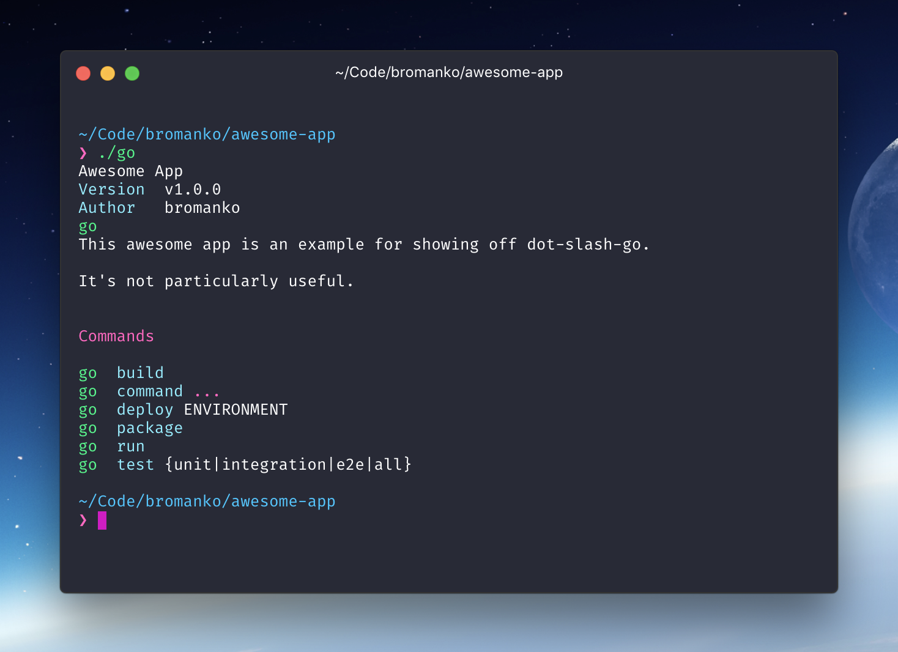

# dot-slash-go [](https://travis-ci.org/bromanko/dot-slash-go)

An extensible, friendly framework for project [go scripts](https://www.thoughtworks.com/insights/blog/praise-go-script-part-i).



## Features

* Simple installation in existing projects
* Easily extend with new commands
* Autogenerated usage instructions

## Installation

In your project root:

```sh
bash -c "$(curl -sS https://raw.githubusercontent.com/bromanko/dot-slash-go/master/install)"
```

## Customizing
Project metadata can be tweaked and changed by simply modifying
the following files in your `.go` directory.

 - **.name** should contain the name of your app, something like "My Awesome App"
 - **.author** is meant to contain your name (or the name of your company)
 - **.version** should contain the version of your app, you can automatically include this using `git describe --tags > .go/.version`
 - **.help** should be a short-ish description of what your app does and how people should use it.
   Don't worry about including help for every command here, or even a command list, Bash CLI will
   handle that for you automatically.

## Adding Commands
dot-slash-go script commands are just a stock-standard script with a filename that matches the command name.
These scripts are contained within your `.go` folder, or within nested folders there if you want
to create a tree-based command structure.

For example, the script `.go/test/hello` would be available through `./go test hello`. Any arguments
passed after the command will be curried through to the script, making it trivial to pass values and
options around as needed.

The simplest way to add a command however, is to just run `./go command create [command name]`
and have it plop down the files for you to customize.

### Contextual Help
The dot-slash-go script provides tools which enable your users to easily discover how to use your 
command line without needing to read your docs (a travesty, we know). To make this possible, 
you'll want to add two extra files for each command.

The first, `[command].usage` should define the arguments list that your command expects to receive,
something like `NAME [MIDDLE_NAMES...] SURNAME`. This file is entirely optional, leaving it out will
have go present the command as if it didn't accept arguments.

The second, `[command].help` is used to describe the arguments that your command accepts, as well as
provide a bit of additional context around how it works, when you should use it etc.

In addition to providing help for commands, you may also provide it for directories to explain what
their sub-commands are intended to achieve. To do this, simply add a `.help` file to the directory.

## Credits
This project is based on the excellent [Bash CLI](https://github.com/SierraSoftworks/bash-cli).
Some changes were made to better fit the needs of a go script. 

* Consolidation of main logic to a single file
* Removal of install/uninstall commands
* Storage of commands and metadata in .go rather than app

## Frequently Asked Questions

1. **Can I use dot-slash-go to run things which aren't bash scripts?**
   Absolutely, dot-slash-go simply executes files - it doesn't care whether they're written in Bash, Ruby,
   Python or Go - if you can execute the file then you can use it with dot-slash-go.
